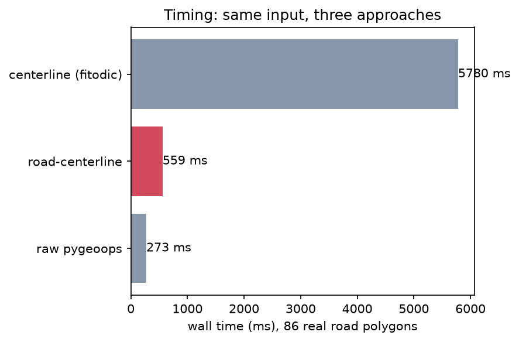

# How this compares

`pygeos` isn't a live comparison target — it was merged into Shapely 2.0 in
2021 and has no independent development; this project already sits on
`shapely>=2.0`. The real comparators are the library road-centerline wraps
([`pygeoops`](https://github.com/pygeoops/pygeoops)) and the other dedicated
PyPI package for this task ([`centerline`](https://github.com/fitodic/centerline)).

Measured with [`benchmarks/compare.py`](https://github.com/DBishal13/Road-Centerline/blob/main/benchmarks/compare.py)
and [`benchmarks/generate_figures.py`](https://github.com/DBishal13/Road-Centerline/blob/main/benchmarks/generate_figures.py)
against the 86 real OSM road polygons in
[`tests/fixtures/utrecht_roads.geojson`](https://github.com/DBishal13/Road-Centerline/blob/main/tests/fixtures/utrecht_roads.geojson):



| | wall time | valid/non-empty output |
|---|---|---|
| **road-centerline** | ~550 ms | 86/86 |
| raw `pygeoops.centerline` | ~280 ms | 86/86 |
| `centerline` (fitodic) | ~5.8 s | 86/86 |

road-centerline is slower than calling `pygeoops` directly — that gap is the
cost of CRS resolution, densification, geometry repair, and attribute
computation happening automatically. It's roughly 10x faster than
`centerline`, which computes a Voronoi diagram per polygon in a Python loop
rather than vectorizing across the layer.

The clean fixture above doesn't show the more common real-world failure
mode: a self-intersecting road polygon. See
[Robustness at scale](robustness.md) for what happens to each approach when
the input isn't clean.

Neither `pygeoops` nor `centerline` produce a connected road network — each
polygon becomes an independent line, even where two road polygons visibly
meet at a junction. See [Building a connected network](network.md).

## Reproducing these numbers

```sh
pip install -e ".[dev]"
pip install centerline  # optional third column
python benchmarks/compare.py
python benchmarks/generate_figures.py  # regenerates the PNGs on this page
```
