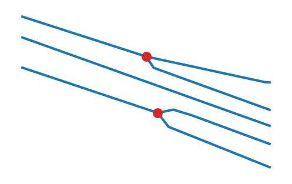

# Demo

This walks through the same steps as
[`Notebooks/centerline.ipynb`](https://github.com/DBishal13/Road-Centerline/blob/main/Notebooks/centerline.ipynb)
— a runnable notebook against 86 real OSM road-surface polygons
(`tests/fixtures/utrecht_roads.geojson`), the same fixture used throughout
the test suite and this docs site. Clone the repo and open it directly for
the interactive version; CI executes it on every push, so it can't go stale.

```sh
pip install -e ".[dev]"
jupyter lab Notebooks/centerline.ipynb
```

## Basic usage

```python
import geopandas as gpd
from road_centerline import compute_centerlines

gdf = gpd.read_file("tests/fixtures/utrecht_roads.geojson")
centerlines = compute_centerlines(gdf, densify_distance=10.0)
```

The messiest interchange in the fixture, overlaid on real aerial imagery —
input polygons on the left, extracted centerlines on the right:


## Robustness to invalid input

```python
>>> pygeoops.centerline(gdf_with_bad_row.geometry)
raw pygeoops fails on invalid input: GEOSException
>>> result = compute_centerlines(gdf_with_bad_row)
road-centerline (auto-repair): 87 rows, all valid = True
```

`on_error="skip"` drops a genuinely unusable row instead:

```python
>>> compute_centerlines(gdf_with_empty_row, on_error="skip")
kept 86 of 87 rows (the empty one was dropped)
```

See [Robustness at scale](robustness.md) for the full picture.

## Road attributes

`length` and `est_width` are added automatically:

| osm_id | area_highway | length (m) | est_width (m) |
|---|---|---|---|
| 1029265252 | motorway | 3671.2 | 20.5 |
| 1029265257 | motorway | 3211.2 | 15.8 |
| 1028749724 | motorway | 3135.8 | 16.9 |
| 1028985759 | motorway | 2979.8 | 14.9 |
| 1029265254 | motorway | 2834.1 | 21.3 |

## Building a connected network

```python
metric_centerlines = centerlines.to_crs(working_crs)  # see the CRS note below
edges, nodes = build_network(metric_centerlines, snap_tolerance=1.0)
# 86 input polygons -> 230 edges, 316 nodes
```



!!! warning "CRS gotcha"
    `compute_centerlines(..., target_crs=...)` only controls the *working*
    math CRS — it still reprojects the returned result back to the input's
    original CRS. Reproject the result yourself before networking, or use
    `process_file(..., build_network=True)`, which handles this for you.

## Equivalent CLI usage

```sh
road-centerline tests/fixtures/utrecht_roads.geojson centerlines.geojson --densify-distance 10
road-centerline tests/fixtures/utrecht_roads.geojson network.gpkg --build-network --snap-tolerance 1.0
```
