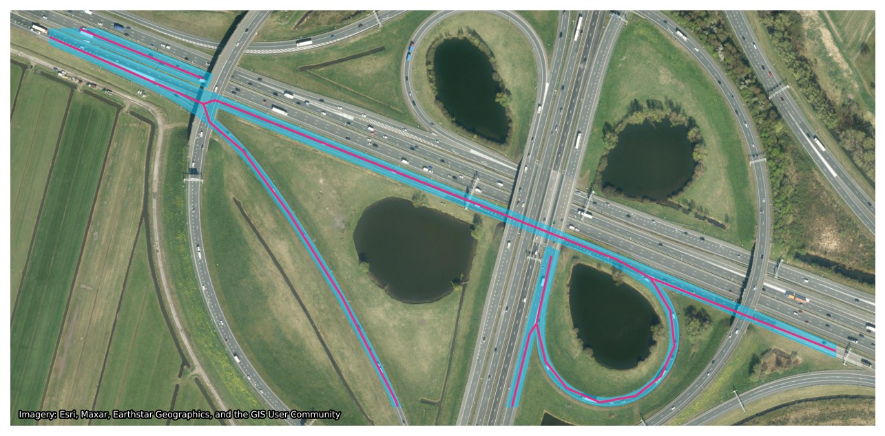
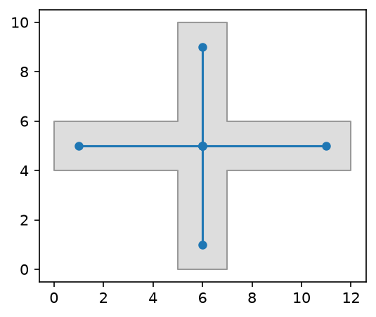

# road-centerline

Extract road centerlines from polygon geometries (road contours) — worldwide,
in any input CRS, in any format [geopandas](https://geopandas.org/) can read
or write.

A real motorway exit ramp and loop near Utrecht: the OSM road-surface
polygon (cyan fill) with its extracted centerline (magenta line) overlaid,
on actual aerial imagery:



Given a polygon representing a road's outline, `road-centerline` optionally
densifies its edges (adding vertices so long, straight edges don't starve the
skeletonization algorithm of detail) and then computes the medial-axis
centerline using [`pygeoops.centerline`](https://pygeoops.readthedocs.io/en/stable/api/pygeoops.centerline.html) —
the basic idea:



On top of that it repairs invalid input, derives per-road attributes, and can
snap adjoining centerlines into a connected network — see
[How this compares](comparison.md).

## Features

- **CRS-aware, globally** — if the input CRS is geographic (e.g. WGS84
  lat/lon), distances are computed in an automatically-estimated local UTM
  zone, then the result is reprojected back to the original CRS. Works
  anywhere on Earth, no manual projection setup required.
- **Any format geopandas supports** — Shapefile, GeoJSON, GeoPackage, and
  more, inferred from the file extension.
- **Vectorized** — centerlines are computed for an entire layer in a single
  `pygeoops.centerline` call; opt into `n_jobs` for parallel chunking on
  very large batches.
- **Robust by default** — invalid input polygons are auto-repaired; a
  genuinely unusable row can be skipped and logged instead of failing the
  whole batch. See [Robustness at scale](robustness.md).
- **Road attributes** — `length` and `est_width` columns computed
  automatically.
- **Network building** — [`build_network()`](network.md) snaps centerline
  endpoints that share a junction into a connected edges/nodes graph, with
  an optional `to_networkx()` export.
- **CLI and Python API** — use it as a command-line tool or import it as a
  library.

## Install

```sh
pip install road-centerline
```

## Quick example

```python
import geopandas as gpd
from road_centerline import compute_centerlines

gdf = gpd.read_file("Road.shp")
centerlines = compute_centerlines(gdf, densify_distance=10.0)
centerlines.to_file("Road_Centerline.shp")
```

See [Quickstart](quickstart.md) for the CLI equivalent and more options, or
[Demo](demo.md) for a full runnable walkthrough against real OSM road
polygons.
