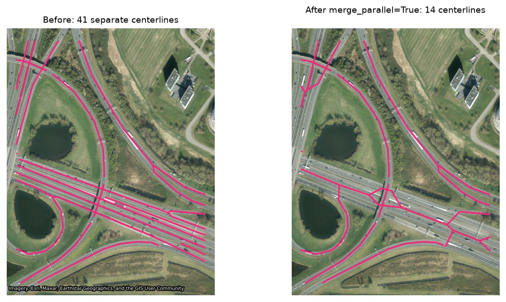

# Merging parallel polygons

Real road datasets — OSM in particular — frequently split one physical
road into several separate polygons: opposing carriageways, individual
lanes, ramps. Each gets its own independent centerline by default, which
is individually correct but reads as chaotic overlapping lines at a busy
interchange where several such polygons converge. A real case in the demo
fixture (see [Demo](demo.md)) has **18 separate polygons** converging at
one crossing point.

## Why not just measure polygon overlap (IoU)?

The obvious first idea — group polygons by Intersection-over-Union — turns
out to be the wrong metric, confirmed against two real polygons from that
same interchange:

- A same-road parallel-carriageway pair, 5.3m apart: **IoU = 0**. They
  don't overlap at all — they sit side by side with a gap (a median strip).
  IoU is an overlap metric; adjacent-but-separate polygons always score
  zero, however obviously they belong together.
- A genuinely different, crossing pair: they do physically overlap a
  little at the crossing (46.6 m²), but **IoU = 0.0004** — one polygon is
  111,503 m², the other 11,693 m², so a real overlap gets swamped by the
  size mismatch. Road polygons vary too much in scale for area-overlap
  metrics to mean anything here.

What actually distinguishes the two cases is different: the same-road pair
sits close together **and runs parallel**; the crossing pair meets briefly
**at a sharp angle**. That's proximity and orientation, not area.

## What `merge_parallel_polygons()` does

Two polygons are merge candidates if they're within `gap_threshold` of each
other *and* their overall orientations — the longest edge of each
polygon's minimum rotated rectangle — differ by less than `angle_threshold`.
Grouping is transitive (A close to B, B close to C merges all three), and
uses an `STRtree` so it doesn't scan every pair on large inputs.

Naively `unary_union`-ing a group with a real gap between members (a
median strip) doesn't work — it silently returns a `MultiPolygon` of the
disjoint parts rather than one merged shape, and centerlining that
produces spurious lines bridging the gap, which is worse than not merging
at all. Each group member is buffered outward to close the gap, unioned,
then buffered back in.

On the real interchange above, this cuts the crossing point from 18
overlapping lines down to one clean line per physical road — the diagonal
highway and the vertical highway stayed correctly separate (68° apart,
well past the default 15° threshold) while ramps and loops that didn't
match either grouping stayed individually distinct:



## Usage

```python
from road_centerline import merge_parallel_polygons, compute_centerlines

merged = merge_parallel_polygons(gdf, gap_threshold=8.0, angle_threshold=15.0)
centerlines = compute_centerlines(merged)
```

Or as a `compute_centerlines()` preprocessing step directly:

```python
centerlines = compute_centerlines(
    gdf, merge_parallel=True, merge_gap_threshold=8.0, merge_angle_threshold=15.0
)
```

`gap_threshold` and `buffer_distance` (default `gap_threshold / 2 + 0.5`)
are distances in the GeoDataFrame's own CRS units — call this on
already-metric-CRS geometry, the same requirement as `densify_distance`
elsewhere in this package.

A `merged_count` column is added (1 for untouched rows, more for merged
groups) so you can see what merged. Other non-geometry columns are
aggregated via `aggfunc` (anything `DataFrame.groupby.agg` accepts —
default `"first"`); the integrated `compute_centerlines(merge_parallel=True)`
path always uses `"first"` — call `merge_parallel_polygons()` yourself
first if you need different aggregation.

This changes the output's row count and attribute values, so it's off by
default — a deliberate choice you opt into, not a silent improvement like
`repair_invalid`.

## Via the CLI

```sh
road-centerline Road.shp Road_Centerline.gpkg --merge-parallel \
    --merge-gap-threshold 8.0 --merge-angle-threshold 15.0
```

## API reference

::: road_centerline.merge.merge_parallel_polygons
