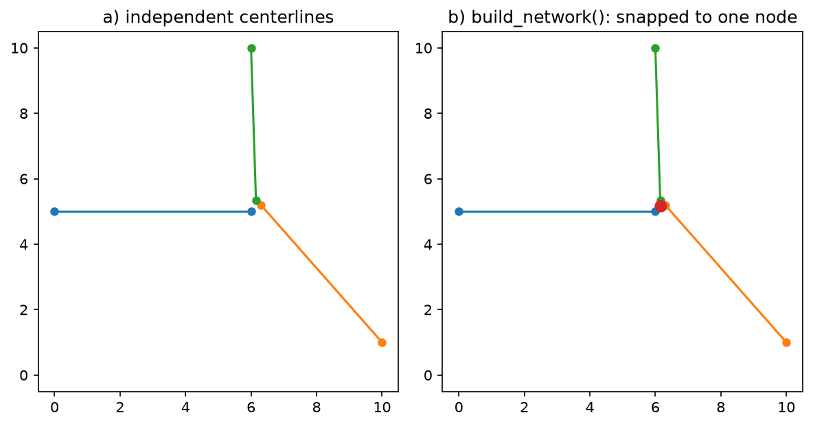

# Building a connected network

`compute_centerlines()` produces one (Multi)LineString per input polygon,
independent of its neighbors. Where two road polygons actually meet at a
junction, their centerline endpoints land close together but not
identically — neither `pygeoops` nor the `centerline` package resolve this;
each polygon just becomes its own disconnected line.

`build_network()` explodes multi-part centerlines into single-line edges and
snaps endpoints within `snap_tolerance` of each other (transitively) into
shared nodes, so the result is an actual routable graph:



Panel (a) is three independent centerlines with endpoints that are close but
not identical — exactly what `compute_centerlines()` produces at a junction.
Panel (b) is `build_network()`'s output: all three now share one node (red).

The same thing on a real, messy road junction from the demo fixture (see
[Demo](demo.md)):


## Usage

```python
from road_centerline import compute_centerlines, build_network, to_networkx

centerlines = compute_centerlines(gdf)

# Network building is distance-based. compute_centerlines() always returns
# the input's original CRS — target_crs only controls the *working* math —
# so reproject to a metric CRS yourself before networking, unless you're
# going through process_file(..., build_network=True), which handles this
# distinction for you automatically.
metric_centerlines = centerlines.to_crs(centerlines.estimate_utm_crs())
edges, nodes = build_network(metric_centerlines, snap_tolerance=1.0)

# Optional: pip install road-centerline[network]
graph = to_networkx(edges, nodes)
```

`edges` keeps every original centerline attribute plus `u`/`v` node-id
columns; `nodes` has one row per node (`node_id`, Point geometry at the
centroid of the endpoints snapped into it).

## Via the CLI / `process_file`

```sh
road-centerline Road.shp Road_Centerline.gpkg --build-network --snap-tolerance 1.0
```

`process_file(..., build_network=True)` runs `build_network()` in the
metric working CRS (so `snap_tolerance` is a sane distance regardless of the
input's own CRS), then reprojects the result back. Output is written as two
layers (`edges`, `nodes`) if the output path is `.gpkg`, otherwise as the
given path plus a sibling `<stem>_nodes<suffix>` file.

## API reference

::: road_centerline.network.build_network

::: road_centerline.network.to_networkx
