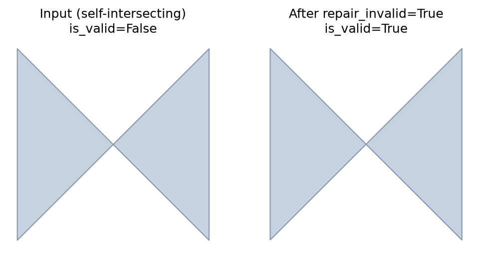

# Robustness at scale

Real road-surface polygons — especially ones derived from satellite/aerial
imagery or messy OSM extracts — are frequently self-intersecting or
otherwise invalid. Calling `pygeoops.centerline()` directly on one aborts
the GEOS call for the *entire* batch:

```python
>>> pygeoops.centerline(gdf_with_one_bad_polygon.geometry)
GEOSException: TopologyException: side location conflict ...
```

`road-centerline` repairs this transparently by default:



```python
>>> compute_centerlines(gdf_with_one_bad_polygon)  # succeeds, all rows valid
```

## Options

```python
compute_centerlines(
    gdf,
    repair_invalid=True,   # default: shapely.make_valid on input polygons
    on_error="skip",       # default "raise": drop unusable rows instead of failing
    n_jobs=-1,              # default 1: chunk across all CPU cores for large batches
)
```

- **`repair_invalid`** (default `True`): runs `shapely.make_valid` on the
  working geometry before densifying/centerlining, vectorized once over the
  whole layer.
- **`on_error`** (default `"raise"`): with `"skip"`, a row that's still
  unusable after repair (`None`/empty/non-polygonal), or that individually
  fails inside `pygeoops.centerline`, is dropped and logged instead of
  failing the whole batch. `"raise"` preserves fail-fast behavior and names
  the offending row indices in the error.
- **`n_jobs`** (default `1`): keeps the single vectorized
  `pygeoops.centerline` call. Any other value chunks the geometry across a
  `ProcessPoolExecutor` (`n_jobs > 0`: that many workers; `-1`: all cores) —
  only worth it for large batches, since process startup has real overhead.

Both CLI flags mirror this: `--repair-invalid`/`--no-repair-invalid`,
`--on-error [raise|skip]`, `--n-jobs`.

## API reference

::: road_centerline.validate.repair_geometries

::: road_centerline.validate.find_unusable
